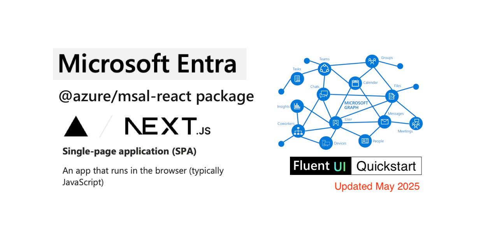

# React single-page application using MSAL React to authenticate users against Microsoft Entra ID

<p align="center">

</p>

This example highlights how to use Microsoft Entra for modern authentication with Next.js and MSAL React, enabling seamless client-side integration with Microsoft Graph.

## ⭐ Like this project?  

If you find this repository useful, please **give it a star**!  

[](https://github.com/dwarfered/react-spa-msal-entra-id-quickstart/stargazers)

## Sample Prerequisites

- [Node.js](https://nodejs.org/en/download/)
- [Next.js v14.2.16+](https://nextjs.org/docs/getting-started/installation)
- [Visual Studio Code](https://code.visualstudio.com/download)
- A modern web browser

## Recommendations

- [Next.js by Vercel](https://nextjs.org/docs) framework documentation.
- [Microsoft Authentication Library (MSAL) for JS](https://github.com/AzureAD/microsoft-authentication-library-for-js)
- [Fluent UI](https://developer.microsoft.com/en-us/fluentui#/) The official front-end framework for building experiences that fit seamlessly into Microsoft 365.
- [Dev Fluent UI](https://react.fluentui.dev/?path=/docs/concepts-introduction--docs) the developer resource.
- [SWR by Vercel](https://swr.vercel.app) React Hooks for Data Fetching
> :information_source: "SWR is a strategy to first return the data from cache (stale), then send the fetch request (revalidate), and finally come with the up-to-date data."
- [jwt.ms](https://jwt.ms) for inspecting your tokens.
- [SPA developers: Migrate implicit to auth code flow with PKCE](https://devblogs.microsoft.com/identity/migrate-to-auth-code-flow/)
- Follow the [Entra ID Blog](https://techcommunity.microsoft.com/t5/microsoft-entra-blog/bg-p/Identity) to stay up-to-date with the latest developments.

## Configure the application

- Open ./lib/msalConfig.ts in an editor.
- Replace Client and Authority for your created Entra Application Registration.

## Installing dependencies
```bash
# Install dependencies from the root of the repo
npm install
```
## Running the application
```bash
# Run locally
npm run dev

# Optionally build
npm run build
```

1. Open http://localhost:3000 to view in your browser.
2. Open http://localhost:3000/profile/me to view a protected route, that if signed in will display profile information.

