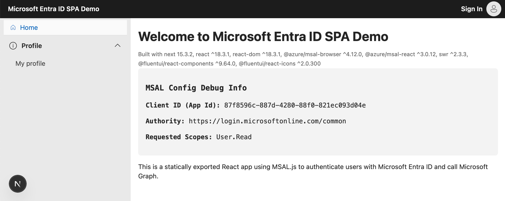
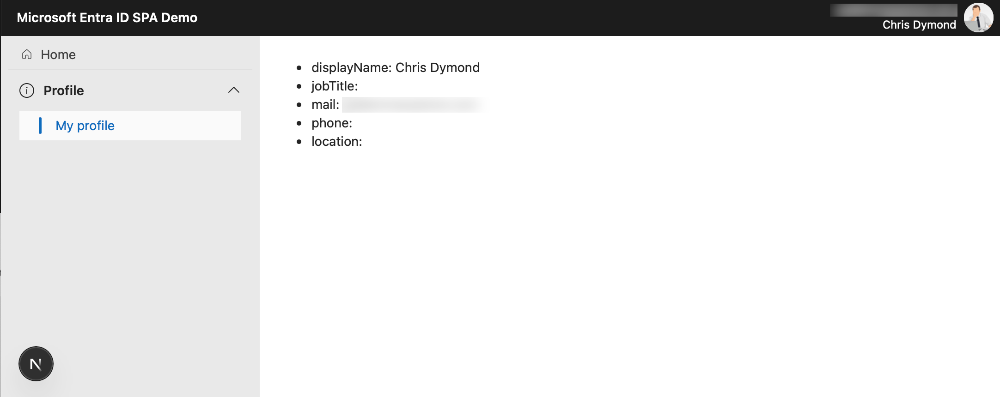

# React SPA with MSAL for Microsoft Entra ID Authentication

This quickstart demonstrates how to authenticate users in a React Single-Page Application (SPA) using the Microsoft Authentication Library (msal-react) with Microsoft Entra ID, and how to access data securely via the Microsoft Graph API.

<p align="center">

</p>

[](https://github.com/vercel/next.js)
[](https://github.com/AzureAD/microsoft-authentication-library-for-js/tree/dev/lib/msal-react)
[](https://learn.microsoft.com/azure/active-directory/develop/v2-oauth2-auth-code-flow)
[](https://github.com/microsoftgraph/msgraph-sdk-javascript)
[](https://github.com/microsoft/fluentui)


## ⭐ Like this project?  

If you find this repository useful, please **give it a star**!  

[](https://github.com/dwarfered/react-spa-msal-entra-id-quickstart/stargazers)

<p align="center">
  
</p>

## ⚙️ Tech Stack

| Category       | Technology                       |
|----------------|----------------------------------|
| Framework      | [Next.js 15.3.2](https://nextjs.org/docs) |
| Language       | TypeScript                       |
| Authentication | [MSAL React](https://github.com/AzureAD/microsoft-authentication-library-for-js) |
| Identity       | Microsoft Entra ID               |
| API            | Microsoft Graph API              |
| UI Framework   | [Fluent UI](https://react.fluentui.dev/?path=/docs/concepts-introduction--docs) |
| Auth Flow      | Authorization Code Flow with PKCE |
| Data Retrieval | [SWR](https://swr.vercel.app)|

## Quickstart Prerequisites

- [Node.js](https://nodejs.org/en/download/)
- [Next.js v15.3.2+](https://nextjs.org/docs/getting-started/installation)
- [Visual Studio Code](https://code.visualstudio.com/download)
- A modern web browser

## 📁 Notable Files

- `app/layout.tsx` – Root layout that wraps the app
- `components/AppClientShell.tsx` – The main client-side layout wrapper for the application. It sets up MSAL authentication, Fluent UI theming, and the core layout structure including the navigation bar and sidebar. It also handles client-side hydration with a loading overlay before rendering the app content
- `lib/msal/config.ts` – MSAL configuration including clientId, authority, and scopes
- `lib/msal/instance.ts` – Exports a singleton `PublicClientApplication` instance
- `lib/msal/helper.ts` – Helper functions for sign-in, sign-out, and token acquisition
- `lib/msgraph/endpoints.ts` - The Microsoft Graph API endpoints that may be called
- `lib/msgraph/fetcher.ts` - A typed fetcher function that performs authenticated GET requests to Microsoft Graph. It attaches a bearer token, handles response types (JSON, blob, image), and supports automatic pagination for OData @odata.nextLink responses.
- `lib/msgraph/helper.ts` -  Retrieves a Microsoft Graph access token using silent authentication with fallback to redirect if user interaction is required. Automatically sets the active account if one is not already set.

## Installing dependencies
```bash
# Install dependencies from the root of the repo
npm install
```
## Running the application
```bash
# Run locally
npm run dev

# Optionally build
npm run build
```

1. Open http://localhost:3000 to view in your browser.
2. Open http://localhost:3000/profile/me to view a protected route, that if signed in will display profile information.

<p align="center">
  
</p>
<p align="center">
  
</p>
